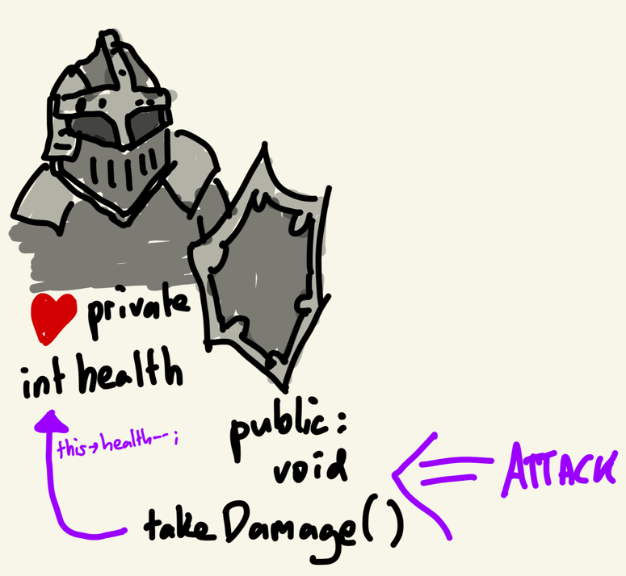
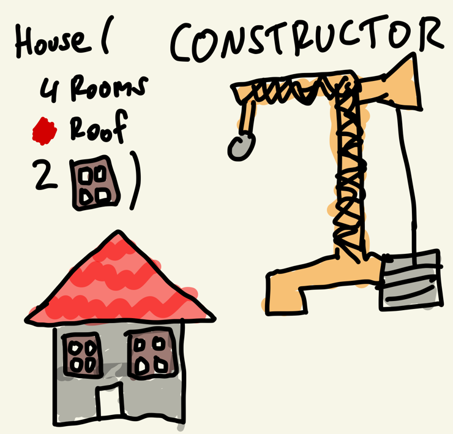
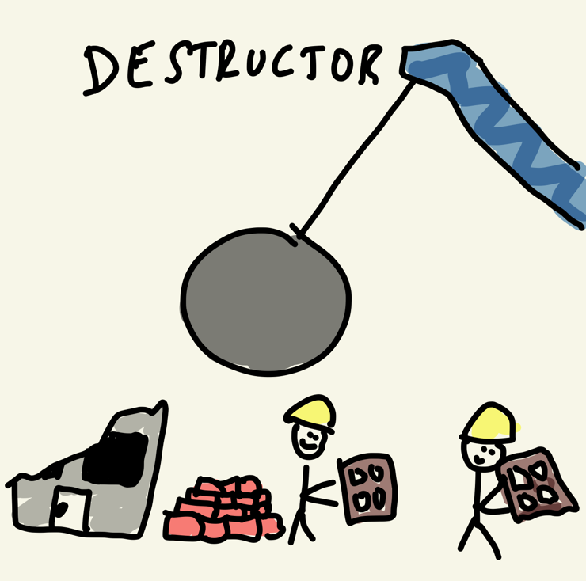
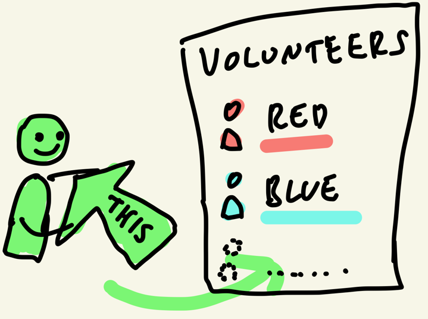
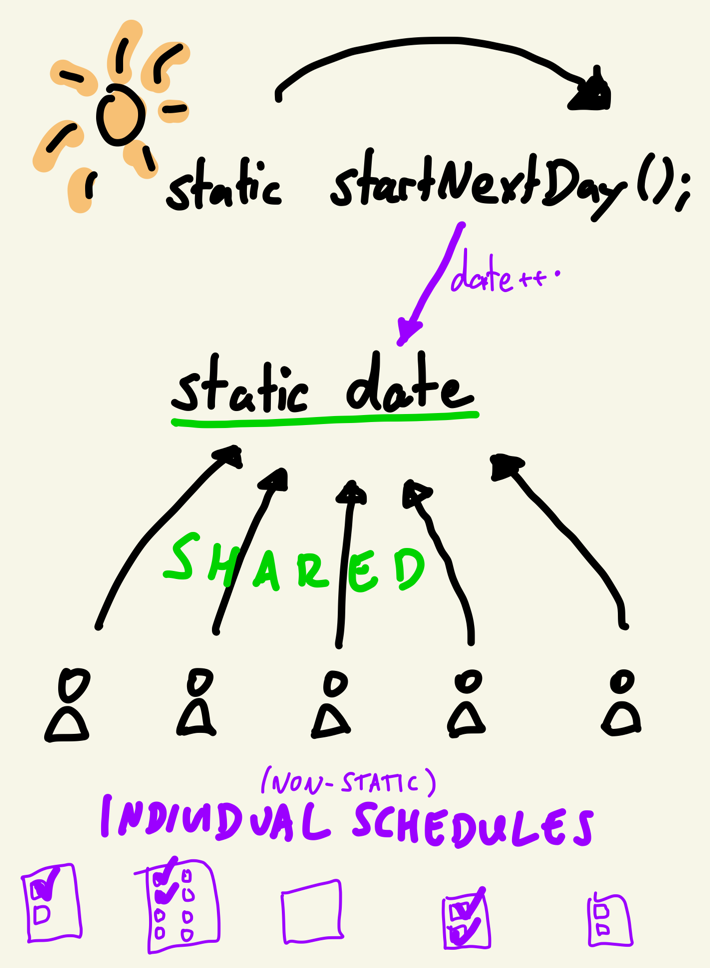

# Fully-Featured Classes

```c++
class Player {
    static int playerCount; // static data member, shared across all players
    int health; // data member, encapsulated (private)
public: // public member declarator
    // parameterless constructor
    Player() : Player{100} {
    }
    // constructor with argument
    Player(int health) : health{health} {
        playerCount++;
    }
    
    ~Player() {
        cout << "Player died.";
        playerCount--;
    }
    
    // static method that can be accessed through type name
    static int getPlayerCount() { return playerCount; }
    
    int getHealth() { return health; } // getter-method
    void setHealth(int value) { // setter-method with data validation
        health = clamp(value, 0, 100);
    }
};
```

- Classes which contain Methods
- Allow for Encapsulation

## Methods

Member Functions
- Have access to all class Members

```c++
struct Time {
	void addYear() {
		year++;
	}
	int year;
};
```

Can only be invoked using
- the member-of operator `.`
- on a class instance (object)

```c++
int main() {
  	Time time;
	time.year = 2022;
	cout << "Time: " << time.year << "\n";
	time.addYear();
	cout << "Time: " << time.year << "\n";
}
```

## Access Control



Structs are `public` per default:

```c++
struct Player {
    int getHealth() { return health; } // getter-method
    void setHealth(int value) { // setter-method with data validation
        health = clamp(value, 0, 100);
    }
private: // private member declarator
    int health; // data member, encapsulated (private)
};
```

Classes are `private` per default:

```c++
class Player {
    int health; // data member, encapsulated (private)
public: // public member declarator
    int getHealth() { return health; } // getter-method
    void setHealth(int value) { // setter-method with data validation
        health = clamp(value, 0, 100);
    }
};
```

There is no other difference between `struct` and `class` in C++!

## Initializing Members

What's the problem in the following code?

```c++
int main() {
	Player one;
	cout << one.getHealth() << "\n";
	one.addHealth(3);
	cout << one.getHealth(); << "\n";
}
```

## Constructors



Give you control over how objects are constructed
- which arguments need to be provided
- how those arguments are used
- note, we will learn soon that this is not the right way of initializing members

```c++
Player() {
    health = 100;
}
Player(int _health) {
    health = _health;
}
```

```c++
int main() {
	Player one{};
	Player two{33};
}
```

## Initializing Class Members In Constructor

Problem:

```c++
#include <iostream>

using namespace std;

struct LevelTracker {
  int experience;
  LevelTracker() { 
      cout << "LevelTracker()\n"; 
      experience = 0; 
  }
  LevelTracker(int startExperience){
   cout << "LevelTracker(" << startExperience << ")\n";
    experience = startExperience;
  }
};

class Player{
  LevelTracker level;
  public:
    Player(){
      level = LevelTracker{5};
    }
};

int main(){
  Player one{};
}
```

Inefficient!

## Initializer List

Solution: Initializer List

```c++
class Player {
  LevelTracker level;
public:
  Player() : level{LevelTracker{5}} {}
};
```

Can be further shortened to:
```c++
Player() : level{5} {}
```

## Destructor



Function that's called when your object is freed ("destroyed")

Use Cases:
- release file handles
- flush network sockets
- free dynamic objects

```c++
struct Monster{
	~Monster(){
		cout << "<dramatic deathrattle>\n";
	}
}
```

```c++
int main(){
	cout << "creating monster.\n");
	{
		Monster monster;
	}
	cout << "done.\n";
}
```

## This-Pointer



Sometimes, you need to access the `current object` from within a method. As in, the object on which the Method is currently being invoked. e.g. when attacking:

```c++
#include <iostream>
struct Unit{
	char* name;
	Unit(char* name){
		// Use case for `this`: name is the name both for the constructor arg as well as the member variable
		this->name = name;
	}

	void attack(Unit* target){
		// Use case for `this`: pass on a pointer to ourselves to the attacked Unit
		target->attackedBy(this);
	}

	void attackedBy(Unit* attacker){
	    cout << name << " got attacked by " << attacker->name << ".\n";
	}
};

int main(){
	Unit hero{"Hero"};
	Unit monster{"Monster"};
	hero.attack(&monster);
}
```

C++ Behind the Scenes:
- `this`-pointer is an implicit, hidden parameter of every non-static member function
- access to data member or call to member function is done by dereferencing this pointer
- is done implicitly, can also be done explicitly

```c++
class Player {
    int health;
public:
    void takeDamage(int amount) {
        health -= amount;
    }
};

int main() {
    Player player{};
    player.takeDamage(5);
}
```

Translates to:

```c++
class Player {
    int health;
public:
    static void takeDamage(Player* _this, int amount) {
        _this->health -= amount;
    }
};

int main() {
    Player player{};
    Player::takeDamage(&player, 5);
}
```

## Static



Variables and Methods that are not associated with a class instance
- can not access `this`

```c++
#include <iostream>

struct Gryffindor {
	int earnedPoints{};
	static int housePoints;
	void gainPoints(int points) {
		earnedPoints += points;
		gainHousePoints(points);
	}
	static void gainHousePoints(int points) {
		housePoints += points;
	}
};

int Gryffindor::housePoints = 100; // starting points

int main() {
	Gryffindor harry{};
	Gryffindor ronald{};
	harry.gainPoints(50);
    ronald.gainPoints(50);
	Gryffindor::gainHousePoints(50);
}
```

- accessible through `TypeName::memberName`
- static member variables only initializable from global scope
  - unless they're `const`


# Quiz

[Link to the Quiz](https://forms.gle/S4QE98xbS2HhZ931A)

# Exercises

## Level Class
- Make a Level Class
- Constructor: `int startLevel`, `int experiencePerLevel`
- Data Members: `level`, `experience`
- Method: `gainExperience(int)`
  - adds `int` to `experience`
  - if `experience` is greater than `experiencePerLevel`: level up!
- Method: `print()`
  - prints `Level: X, Experience: X` to the Console.

```c++
Level level{1, 10}; // Level: 1, Experience: 0
level.print();
level.gainExperience(9); // Level: 1, Experience: 9
level.print();
level.gainExperience(3); // Level: 2, Experience: 2
level.print();
level.gainExperience(18); // Level: 4, Experience: 0
level.print();
```

## Calculator Class
- Make an Object-Oriented Calculator Application
  - Add a class named `Calculator`
  - Implement the following functions:

```cs
Calculator calculator;
calculator.SetNumber(5); // change the state (member variable)
calculator.SetOperation(Operation::Add); // enum
calculator.SetNumber(3);
cout << calculator.getNumber() << "\n"; // should say 8
calculator.Clear();
calculator.SetNumber(2);
calculator.SetOperation(Operation::Multiply);
calculator.SetNumber(3);
calculator.SetOperation(Operation::Subtract);
calculator.SetNumber(1);
cout << calculator.getNumber() << "\n"; // should say 5
```

## String-Class!

The String Class will be used to make using strings easier in C++!

It will allow us to easily:
- Create Strings
- Modify Strings
- Combine Strings
- Compare Strings

For now, we will have one limitation:
- In the constructor, the user of the class must provide a `maxLength` for each string
  - This `maxLength` may not be exceeded while using the class instance
  - This makes it easier for you, so you won't have to resize the internal buffers
- The reason is, that strings are internally arrays of characters, as you may know
  - So, if you wanted your `string` class to be able to hold any string without the user providing a `maxLength`...
  - ...you would have to implement something like a List / DynamicArray in C#
  - which automatically resizes as new elements are added
  - This means that you create a new buffer, copy the contents from the old to the new buffer and delete the old buffer

### Example Usage
```c++
String helloWorld{"Hello", 100};
helloWorld.appendLine(", World!");
helloWorld.append("Alli");
helloWorld.appendLine("hopa!");
helloWorld.print();
```

Output:
```
Hello, World!
Allihopa!
```

And all of that without having to think about Pointers or Arrays ever again

In fact, C++ comes with its own OOP `string` class which we will use in the future!

### Private Members
You need to figure out the types yourself:
- `xxx length;` 
  - the length will tell us, how long the currently stored string is
  - e.g. `4` for `"Marc"`
- `xxx maxSize;`
  - this variable will be provided by the user in the constructor
  - and set a limitation on how long this string can ever become
  - it may not be exceeded as the user appends more to this string
- `xxx buffer;`
  - the buffer is used to store the characters of this string
  - you can use `maxSize` for the size of the buffer

### Public Members
- `ctor(xxx maxSize)`
  - add a log so you see that an empty string gets constructed
  - create buffer
  - initialize `length` & `maxSize`
- `ctor(xxx defaultText, xxx maxSize)`
  - add a log so you see that a non-empty string gets constructed
  - create buffer
  - initialize `length` & `maxSize`
  - append defaultText
- `~()`
  - add a log so you see what string gets deconstructed
  - delete buffer
- `append(xxx text)`
  - checks for maxSize! -> exception
  - adds the given text to the string's buffer
  - updates length
- `appendLine(xxx text)`
  - checks for maxSize! -> exception
  - adds the given text + line break to the string's buffer
  - updates length
- `void print()`
  - prints the string that's currently buffered
- `xxx getString()`
  - returns a c-style string for the currently buffered contents

### More Info

What is a buffer?
- it is just a data storage that's allocated with more size than originally needed so it can be filled with more data later

What is a buffer in this case?
- an array of characters in which we can store text.

e.g. the `maxSize` might be 10 and the text `"hej"`:

`{'h','e','j','\0','\0','\0','\0','\0','\0','\0'}`
- `maxSize`: `10`
- `length`: `3`

Now, if you append a text like `"san!"`:

`{'h','e','j','s','a','n','!','\0','\0','\0'}`
- `maxSize`: `10`
- `length`: `7`