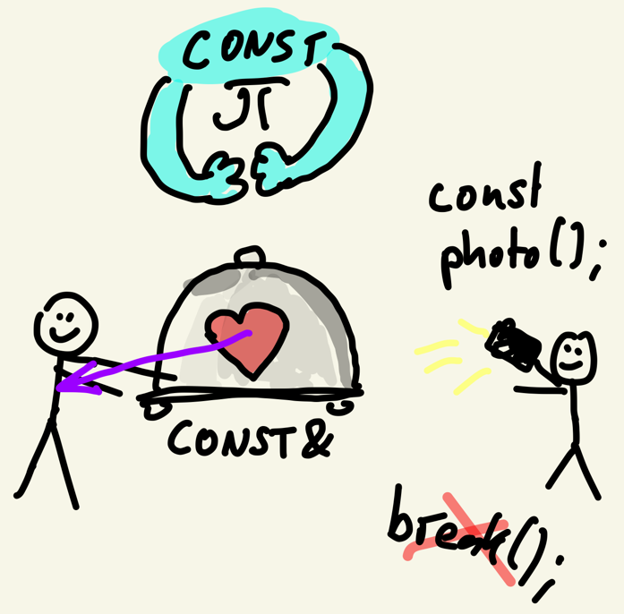

# Const



```c++
class Player {
    const int maxHealth;
    const int id;
    int health;
    
    // const methods mark a method 
    void getHealth() const {
        return health;
    }
    // a const reference argument avoids copies while
    // still ensuring that variables aren't changed
    void greetPlayer(const Player& other) const {
        cout << "Player " << id " greets " << other.id << "\n";
    }
};
```

Short for "constant"
- i.e. "cannot be modified"
- gives compiler errors if violated

Useful for:
- passing in references/pointers without the value being modifiable
- allowing compiler-optimizations vor variables that never change
- reducing complexity (no need to debug values that can't change)

## Const Values

```c++
#include <iostream>
using namespace std;

int main() {
	const float pi = 3.14f;
	
	cout << pi << "\n";
	
	pi = 4; // ERROR
}
```

## Const References

```c++
#include <iostream>
void printButDoNotModify(const char* name){
	cout << name;
	name[0] = 'K'; // ERROR
	name = "Marc";
}

int main() {
	char* name = "Marc";
	printButDoNotModify(name);
}
```

## Const Methods

The following code won't compile:

```c++
class Player {
	int health{100};
public:
	int getHealth() {
		return health;
	}
};

void printButDoNotModify(const Player& player){
    cout << "Health: " << player.getHealth() << "\n";
}

int main() {
	Player one{};
	printButDoNotModify(one);
}
```

Error: `this` argument to member function `getHealth` has type `const Player`, but method is not marked `const`

Reason is, that only `const` methods can be invoked on `const` variables.

### Definition

```c++
int getHealth() const {
	return health;
}
```

### Usage

```c++
int getHealth() const {
	return ++health; // Won't compile - error: cannot assign to non-static data member within const member function 'getYear'
}
```

## Const Members

```c++
struct Unit {
	const int maxLevel = 100;
	DateTime birthDate;
}
```

### Initializer List
Within an initializer list, you can assign to `const` data members
```c++
#include <iostream>

struct Unit {
	const int maxLevel = 100;
	const int id;
	const DateTime birthDate;
	Unit(int id, int year) : id{id}, birthDate{year}{

	}
};

int main(){
	Unit unit{1337, 1990};
	printf("Unit #%d, born %d", unit.id, unit.birthDate.getYear());
}
```

## Mutable Members
Overrides/ignores const function access. 

Useful for:
- access counters
- caching
- debugging

```c++
class Circle {
  mutable int accessCounter;
  float radius;
  
public:
  float getRadius() const {
      accessCounter++;
      return radius;
  }
}
```

## Volatile Members
Tells the program that a variable may change outside the context of a program
- therefore, the cpu cannot cache it
- and instead must read it from RAM every time

Used for:
- memory-mapped hardware ports
- memory shared between threads/processes
```c++
volatile int i;
```

## Static Members
- Not bound to the instance of a class
- Effectively global
- but within the namespace of a class

## Static
`static` has no less than 4 meanings in C++

- static member functions (C++)
- static data members (C++)
- static global functions (C)
  - become file-local
- static local variable  (C)
  - effectively become global; value survives across calls
  - use still restricted to function scope
  - no name clashes with outside

# Quiz

[Link to the Quiz](https://forms.gle/o3aDbsFnM8tNoygs5)

# Exercise
Update your `String` class for `const`-correctness
- which data members can be `const`?
- which function arguments?
- which functions can be made `const`?

Hint: Rider will greatly help you with this.
- But try to understand, why these members can/should be `const`!