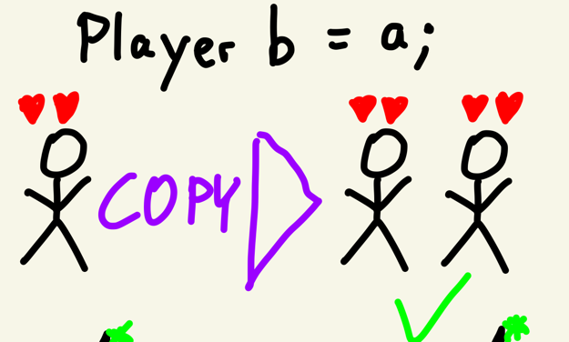
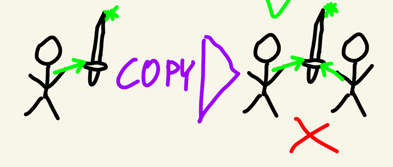
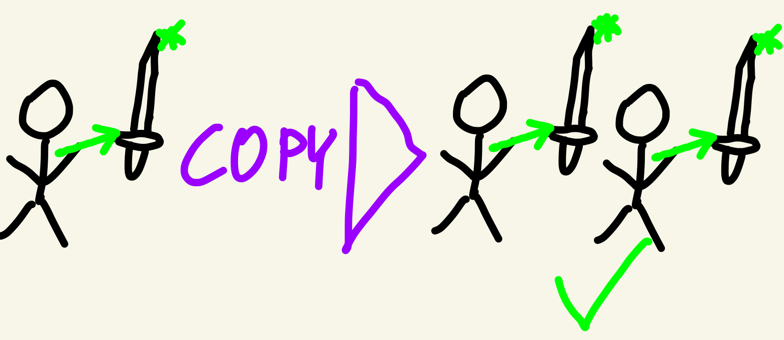
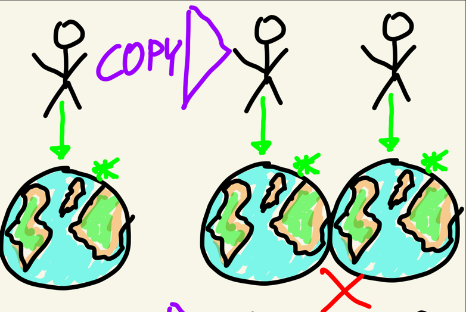
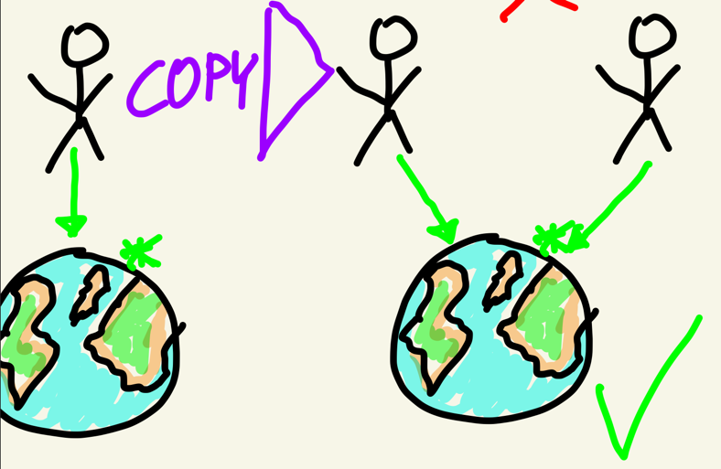

# 4 Copy

```c++
class Player {
    Item* item;
public:
    // define a copy constructor in which the item gets cloned
    Player(const Player& other) {
        if(other.item)
            item = new Item(*other.item);
        else
            item = nullptr;
        end if
    }
    
    // define a copy assignment operator
    Player& operator=(const Player& other) {
        if (this == &other) return *this; // performance benefit if `a = a`
        if(item) delete item; // delete our old item
        
        if(other.item)
            item = new Item(*other.item);
        else
            item = nullptr;
        end if
        return *this;
    }
};
```

## Introduction



Whenever we pass a value from a to b
- an exact clone of the object will be created


### Shallow Copying Items



The problem is: Some objects might contain references (pointers) to other objects
- e.g. the Player carries an Item


```c++
class Player {
   Item* item;
};

// Player #1 carries Item #1
Player original{new Item{}}; 
```

Now, if you copy the Player, the Player will be copied, but the Item will still be the same:

```c++
// Player #2 carries Item #1 as well!
Player clone = original; 
```

This can lead to problems, e.g. if Player b gets destructed:

```c++
class Player {
  // Player deletes its item on death
  ~Player(){ delete item; } 
};

// Player #2 deletes Item #1
delete clone; 
// Player #1's Item #1 has now been destroyed :(
original.tryAttack(); 
```

What happened above is what's called a Shallow Copy
- That is, a copy which copies all Members
- But if those Members are References, they will still point to the same instance

### Deep Copying Items



What we need, is a Deep Copy
- That is, a copy which not only copies all Members
- But also clones all Members, if those are References (Pointer Types)

### Deep Copying Planets



But we don't always want to deep copy references.
- e.g. if the Player references the planet he stands on

```c++
class Player {
    Planet* standingOn;
}
```

### Shallow Copying Planets



Instead, in these cases, we want to create a shallow copy.
- both Players will stand on the same planet

## Copy Semantics
After copying `a` to `b` they should be
- equivalent: `a == b`
- independent: modifying `a` does not cause a modification of `b`

## When are values copied? And How?
Values are constantly copied whenever you assign them to another variable or a function parameter:
```c++
int foo(int input){
	int result = input+1; // copying (input+1) into result
	return result;
}

int a{5}; // initializing a
int b = a; // Copy Constructor: a into b
int c{a}; // Copy Constructor: a into c
int d = foo(a); // Copy Constructor: a into input; Copy Constructor: result into d
int e{3};
e = a; // Copy Assignment: a into e
```

### Copying Base Data Types
No surprises here, we know, how this works:
```c++
int increase(int number){
	number++;
	return number;
}

int main() {
	int original{1};
	int result = increase(original); // copy original to number & return value to result
	printf("original: %d, result: %d", original, result); // copy original and result to function
}
```

### Copying PODs
Member-wise copy
- each member value is copied into the parameter
- effectively it's a bitwise copy from one address to another

```c++
struct Vector2 {
	int x,y;
};

Vector2 increase(Vector2 p){
	p.x++;
	p.y++;
	return p;
}

int main() {
	Vector2 original{3, 5};
	Vector2 result = increase(original); // copies all 8 bytes (x and y) to p and the return value back to result
	printf("original: %d, result: %d", original.x, result.x);
}
```

### Copying Fully-Featured Classes
- what happens, when the Player class gets copied?
- what happens, when one instance gets deallocated?

```c++
int main() {
	Player a{100, new Item{"Golden Sword"}};
	std::cout << a.item->name << "\n"; // fine
	{
		Player b = a;
	    std::cout << a.item->name << "\n"; // fine
	}
	std::cout << a.item->name << "\n"; // a broke!
}
```

Problem:
- player a has an item allocated at `ADDRESS_A`
- player b gets the same address `ADDRESS_A`
- when player b gets destructed
  - they destroys their item at `ADDRESS_A`
- player a's item is now broken

## Copy Constructor
To fix this, we need more control over what happens, when one Player gets copied to another.

```c++
Player(const Player& other){
	/*...*/
}
```

Invoked When:
- copying into an uninitialized object

```c++
Player b = a; // copy constructor, because b gets constructed wit the value of a
```

There are two ways of copying members:

### Shallow Copy
- copy pointer address
- meaning, that both objects will reference the SAME address

This is needed, if e.g. you want to clone an Player which has a reference to the Planet he stands on. You don't want to clone the Planet, then, right?

```c++
Planet* standsOn;

Player(const Player& other){
	// shallow copy, don't want to clone the Planet as well:
	this.standsOn = other.standsOn;
}
```

### Deep Copy
- look up object at pointer
- allocate `new` object
- assign new object pointer
- copy data from old object value to new

This is needed e.g. when each unit has an Item
- and you want both the copied Unit to have a copy of the item
- not share the same instance 
- an Item can't be in two places at the same time

```c++
Item* item;

Player(const Player& other){
	// deep copy. We create a new Item on the HEAP and copy the other item into it:
	this.item = new Item{*other.item};
}
```

### Copy Assignment
Unfortunately, that's not all. There's also a Copy Assignment Operator `=`
- which is invoked when copying into an already constructed object

```c++
Player& operator=(const Player& other) {
	if (this == &other) return *this; // performance benefit if `a = a`
	// first, clean up this object, e.g. delete existing Items, Buffers, etc.
	// then, clone the other object, e.g. copy their Items, Buffers etc.
	return *this;
}
```

Why is the Return Type `String&`?
- Same question as what's the difference between
  - `a = b = c;`
  - `(a = b) = c;`

Why does it return `*this`?
- The Type of `this` is `Player*`
- And we need a value type to get its reference `&`:

```c++
Player one{};
Player* addressOfOne = &one;

Player& referenceToOne = one;
Player& alsoRefToOne = *addressOfOne;
```

```c++
Player a{100, new Item{"Golden Sword"}};
Player b{50, new Item{"Wooden Sword"}}; // b is initialized
b = a; // Copy Assignment, because b has already been initialized
```

### Deep Copy

This time, you need to ensure to clean up all objects that you deep copied:

```c++
Item* item;

Player& operator=(const Player& other) {
	if (this == &other) return *this; // performance benefit if `a = a`
	delete this.item; // delete the item that we had before copying the other object into us
	this.item = new Item{other.item}; // now, copy the other item and use it
	
	return *this;
}
```

### Shallow Copy

But beware, this doesn't go for shallow copied objects:

```c++
Planet* standingOn;

Player& operator=(const Player& other) {
	if (this == &other) return *this; // performance benefit if `a = a`
	delete this.standingOn; // WRONG: This would destroy the planet
	this.standingOn = other.standingOn; // shallow copy the other Player's Planet (e.g. Mars):
}
```

## Default Copy
Why does the following code work, even though we haven't defined a copy constructor or assignment operator?
```c++
struct Vector2{
	int x,y;
};

int main(){
	Vector2 a{2, 3};
	Vector2 b = a; // copy constructor
	b = Vector2{4, 5}; // coppy assignment
}
```

The compiler generates default implementations for copy construction anc copy assignment
- but that can be unintended

To make your intention obvious
- explicitly define that you want to use default implementations

```c++
struct Vector2{
	int x,y;
	Vector2(const Vector2&) = default;
	Vector& operator=(const Vector&) = default;
}
```

## No Copy
Some classes, you never want to be copied
- e.g. a GameGrid which takes up a lot of Memory
- mark the copy constructor and assignment operator as `delete`

```c++
struct GameGrid {
	GameGrid(const GameGrid&) = delete;
	GameGrid& operator=(const GameGrid&) = delete;
}
```

It will generate compile errors when trying to copy your class:

```c++
GameGrid a;
GameGrid b = a; // Compile Error
```

## Copy Guidelines

### Correctness
Ensure that no exceptions happen (e.g. double deletion of buffers)

### Independence
Further changes to the copy should not affect the original and vice versa.

### Equivalence
The original and the copy should have equal values.


# Quiz
[Link to the Quiz](https://forms.gle/SciLd7Xwx3Rv5EBN9)

# Exercise
- Implement Copy Semantics into your `String` class