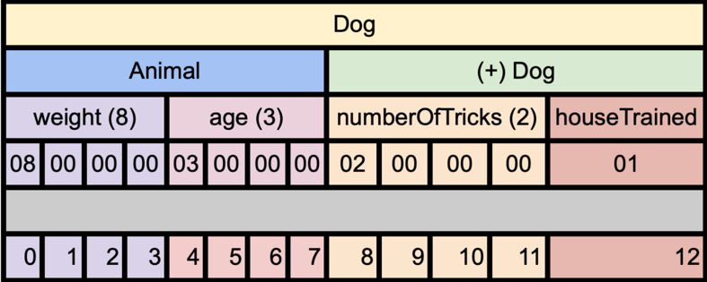
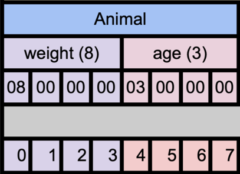
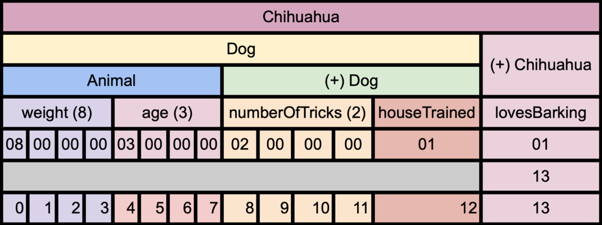
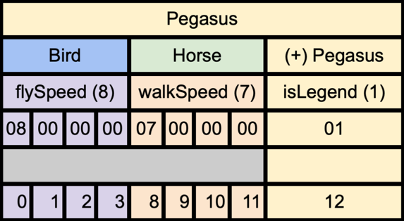
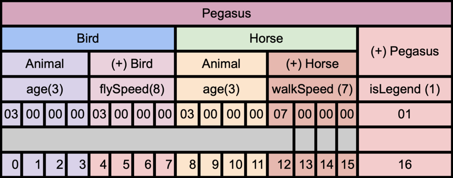

# 8 Polymorphism

## Memory Layout
- Allows for Polymorphism
- At the Address of `Dog`
- You find the Data of type `Animal`
- i.e. `Dog` IS AN `Animal`

```c++
class Animal {
    int weight;
	int age;
};

class Dog : public Animal {
    int numberOfTricks;
	bool houseTrained;
};
```

```c++
void pet(Animal* animal) {/*...*/}

Animal* animal = new Dog{};

Dog* dog = new Dog{};
pet(dog);
```




### Conversion
- If you use the base class as a value...
- Type `Dog` "shrinks" to Type `Animal`:
```c++
Animal animal = Dog{};
```



### Inheritance Trees

```c++
class Chihuahua : public Dog {
  public:
    bool lovesBarking;
}
```



### Hiding Members
- Early Binding

```c++
struct Animal {
    void MakeSound() { cout << "...\n"; }
};

struct Dog : Animal {
    void MakeSound() { cout << "Woof!\n"; }
};
```

```c++
int main()
{
    Animal* dog = new Dog{};
    dog->MakeSound();
}
```

Remember it is the same as:

```c++
Animal* dog = new Dog{};
Animal::MakeSound(dog);
```

This will be solved by Virtualization!

## Multiple Inheritance

```c++
struct Bird {
	int flySpeed;
};

struct Horse {
	int walkSpeed;
};

struct Pegasus : Bird, Horse {
	bool isLegend;
}
```



### Memory Layout
No Pointer Identity!
- `class` Bird
  - `flySpeed`;
- `class` Horse
  - `walkingSpeed`;
- `isLegend`

```c++
Pegasus value{};
Pegasus* pegasus = &value;
Horse* walking = &value;
Bird* flying = &value;
```

This will be solved by Virtualization!

### Dreaded Diamond
Class `Pegasus` will end up having TWO `age` variables
- This is obviously undesired!
```c++
struct Animal {
	int age;
}
struct Bird : public Animal {
	int flySpeed;
};

struct Horse : public Animal {
	int walkSpeed;
};

struct Pegasus : Bird, Horse {
    bool isLegend;
}
```




# Quiz

What is the memory layout when a Dog object is treated as an Animal object?
- A) The memory layout of a Dog object.
- B) The memory layout of an Animal object.
- C) A mixture of Dog and Animal memory layouts.
- D) The memory layout depends on the compiler.

What happens during conversion when a Dog object is assigned to an Animal object?
- A) The whole Dog object is copied into the Animal object.
- B) The Animal part of the Dog object is copied into an Animal object.
- C) The Animal object is converted into a Dog object.
- D) Conversion between unrelated types is not allowed.

What problems arises in the context of multiple inheritance, as illustrated by the "Dreaded Diamond" diagram? (3)
- A) Memory fragmentation
- B) Name clashes
- C) Inefficient memory layout
- D) Pointer identity loss