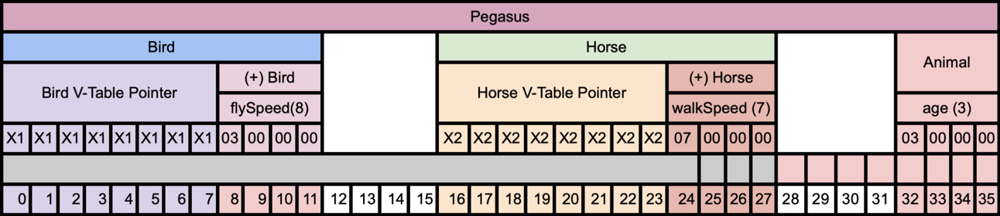
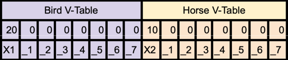

# 9 Virtualization
Dynamic Linking of Functions and Base Classes during Runtime

## Virtualization

### Virtual Methods
- Late Binding

```c++
struct Animal {
    virtual void MakeSound() { cout << "...\n"; }
};

struct Dog : public Animal {
    virtual void MakeSound() override { cout << "Woof!\n"; }
};

int main()
{
    Animal* dog = new Dog{};
    dog->MakeSound();
}
```

### V-Table
- LookUp Function Name -> Function Instance
  - Exists in Memory once for each type
- Referenced by each class instance
  - Size of Type Changes
- Initialized in Constructor
  - Should not directly invoke constructor manually
  - Can't call virtual functions in constructor (why?)

### V-Tables & Value Types
What's wrong with this code?
```c++
int main()
{
    Animal dog = Dog{};
    dog.MakeSound();
}
```

### Co-Variant Virtual Return Type
You can change virtual function's return types
- If the Type is co-variant

```c++
struct Animal {
    virtual Animal* Clone() {/*...*/};
};

struct Dog : public Animal {
    virtual Dog* Clone() override {/*...*/};
};
```

## Destructor
Memory Leak:

```c++
struct Animal {
    virtual void MakeSound() {}
};

struct Dog : public Animal {
    char* name;
    Dog() : name {new char[100]} { cout << "Dog()\n"; }
    ~Dog() { delete[] name; cout << "~Dog()\n"; }
    virtual void MakeSound() override { cout << "Woof!\n"; }
};

int main()
{
    Animal* dog = new Dog{};
    dog->MakeSound();
    delete dog;
}
```

Fix: Virtual Destructor
- Your classes that you intend to inherit from
- should always have a `virtual` Destructor
```c++
struct Animal {
    virtual void MakeSound() {}
    virtual ~Animal() {};
};

struct Dog : public Animal {
    char* name;
    Dog() : name{ new char[100] } { }
    ~Dog() override { delete[] name; }
    virtual void MakeSound() override { printf("Woof\n"); }
};

int main()
{
    Animal* dog = new Dog{};
    dog->MakeSound();
    delete dog;
}
```

## Abstraction
- Cannot be instantiated
- But classes can inherit from this class
  - And those can be instantiated
```c++
struct Animal {
    virtual void MakeSound() = 0;
};

struct Dog : public Animal {
    virtual void MakeSound() override { cout << "Woof!\n"; }
};
```

```c++
int main()
{
    Animal* dog = new Dog{};
    dog->MakeSound();
}
```

### Abstract Type Variables
Why does this code not compile?
```c++
int main(){
	Animal dog = Dog{};
	dog.MakeSound();
}
```

## Virtual Base Class
- Virtual Base Classes are only inherited once
```c++
struct Animal {
	int age;
}
struct Bird : virtual Animal {
	int flySpeed;
};

struct Horse : virtual Animal {
	int walkSpeed;
};

struct Pegasus : Bird, Horse { }
```





## Dynamic Cast
Solves the problem of lack of Pointer Identity
- Only possible for classes with V-Tables
- i.e. classes with `virtual` methods or base classes
- Use `dynamic_cast`:

```c++
Pegasus* pegasusAgain = dynamic_cast<Pegasus*>(animal); // OK
```

## Interfaces
Good Use Case of Multiple Inheritance
- abstract class
  - no data members
  - all functions pure virtual

Advantages
- no data member classes
- diamond not harmful 
  - cannot inherit data members multiple times

- still no pointer identity!
  - dynamic_cast necessary!

# Quiz

What is the primary feature of runtime polymorphism in C++?
- a) Function overloading
- b) Inheritance-based polymorphism
- c) Static binding
- d) Template specialization

What is the purpose of `virtual` methods in C++?
- a) To enable function overloading
- b) To facilitate late binding
- c) To enforce compile-time binding
- d) To optimize memory allocation

What is the role of a V-Table in C++?
- a) It stores the size of each class instance.
- b) It maps function names to function instances for dynamic dispatch.
- c) It stores the data members of each class.
- d) It manages static member functions.

What is a co-variant virtual return type in C++?
- a) It allows changing the return type of a `virtual` function to a subtype in a derived class.
- b) It enforces that the return type of a `virtual` function in a derived class must be the same as in the base class.
- c) It prohibits changing the return type of a `virtual` function in a derived class.
- d) It allows changing the return type of a `virtual` function to a base type in a derived class.

Why is it important to have a `virtual` destructor in C++ classes intended for inheritance?
- a) To prevent memory leaks
- b) To ensure proper destruction of derived class objects
- c) To allow dynamic allocation of class instances
- d) To enhance runtime performance

What is an abstract class in C++?
- a) A class that cannot be instantiated and contains one or more pure `virtual` functions.
- b) A class that can be instantiated but cannot be inherited from.
- c) A class that can be instantiated but has restricted access to its members.
- d) A class that can be inherited from but cannot contain data members.

What is the primary advantage of `virtual` base classes in C++?
- a) They reduce memory usage by eliminating duplicate inherited members.
- b) They prevent the "diamond problem" in multiple inheritance.
- c) They allow for efficient dynamic casting between related classes.
- d) They improve code readability by organizing class hierarchies.

When is `dynamic_cast` applicable in C++?
- a) Only for classes without `virtual` methods
- b) Only for classes with multiple inheritance
- c) Only for classes with `virtual` methods or base classes
- d) Only for classes with `static` member functions
